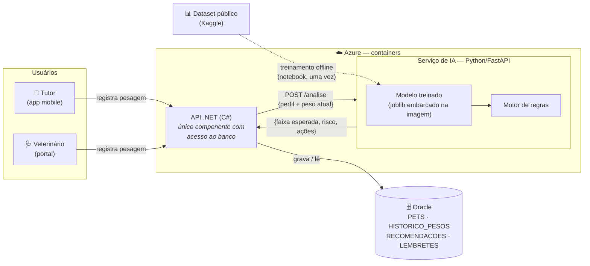
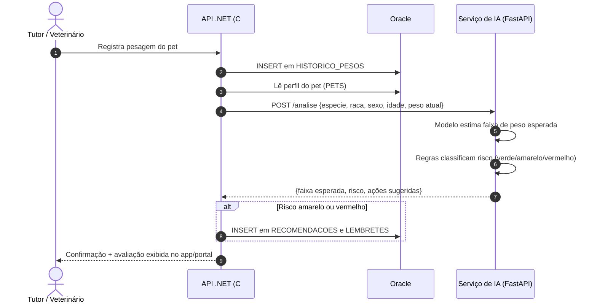

# Fidelis — Componente de Inteligência Artificial

**Projeto:** Fidelis — Gestão de Saúde Pet (React Native/Expo)

**Equipe:** Driven Soft · Challenge FIAP 2026 · Parceria CLYVO VET

**Entrega:** 3º Sprint — Disruptive Architectures: IoT, IoB & Generative IA

**Repositório no Github:** https://github.com/Driven-Soft/Fidelis-IOT-IA

### Integrantes

| Nome | RM |
| --- | --- |
| Felipe Bezerra Beatrici | RM 564723 |
| Max Hayashi Batista | RM 563717 |
| Henrique Cunha Torres | RM 565119 |
| Yasmin Nathalin Miranda dos Santos | RM 561365 |
| Lucas da Silva Lima | RM 562118 |

## Sumário

1. [Problema de negócio tratado pela IA](#1-problema-de-negócio-tratado-pela-ia)
2. [Contribuição da IA: personalização, priorização e apoio à decisão](#2-contribuição-da-ia-personalização-priorização-e-apoio-à-decisão)
3. [Abordagem de IA adotada e justificativa](#3-abordagem-de-ia-adotada-e-justificativa)
4. [Dados: origem, estrutura e utilização](#4-dados-origem-estrutura-e-utilização)
5. [Fluxo de dados e arquitetura de integração](#5-fluxo-de-dados-e-arquitetura-de-integração)
6. [Síntese](#6-síntese)

---

## 1. Problema de negócio tratado pela IA

O Fidelis nasce para resolver a desconexão entre tutores e clínicas veterinárias: hoje o contato acontece de forma reativa, apenas em emergências ou em gatilhos pontuais como a vacinação, o que fragmenta o cuidado e impede a construção de um histórico clínico longitudinal. Dentro dessa jornada contínua que o aplicativo propõe, o componente de IA ataca um problema específico e de alto impacto clínico: **a identificação automática de peso inadequado ao perfil do animal**.

O peso corporal é um dos indicadores mais sensíveis e mais negligenciados da saúde de cães e gatos. Sobrepeso e obesidade estão associados a diabetes, doenças articulares e cardiovasculares e redução de expectativa de vida, enquanto o baixo peso é frequentemente sinal de doenças renais, endócrinas, odontológicas ou nutricionais. O problema é que o tutor raramente sabe qual é o peso adequado para o perfil do seu animal — a faixa saudável varia enormemente conforme espécie, raça, sexo e idade — e o veterinário só avalia o animal quando ele é levado à clínica, exatamente o comportamento reativo que o Fidelis quer superar.

O componente de IA transforma cada pesagem registrada no app em uma **avaliação automática de risco**: um modelo preditivo, treinado com dados públicos de referência sobre características de raças e pesos de animais (Kaggle), estima a faixa de peso esperada para o perfil daquele pet e a compara com o peso atual registrado, classificando o risco e convertendo essa avaliação em ações concretas dentro do app (recomendações, lembretes e alertas no prontuário). Assim, a IA é o mecanismo que materializa a promessa central do produto — cuidado proativo, personalizado e ao longo da vida — em vez de ser um recurso decorativo.

## 2. Contribuição da IA: personalização, priorização e apoio à decisão

**Personalização.** Não existe "peso certo" universal: um Yorkshire adulto saudável pesa em torno de 3 kg, um Labrador pode passar de 30 kg. O modelo estima a faixa de peso esperada **para o perfil específico de cada pet**, a partir dos atributos cadastrais (`Especie`, `Raca`, `Sexo` e idade calculada de `DataNascimento`), aprendidos sobre a base de referência. A saída não é uma regra genérica, e sim uma avaliação individualizada: "para *este* perfil, o peso atual está X% acima/abaixo da faixa esperada".

**Priorização de ações.** Cada nova pesagem gera uma **classificação de risco** em três níveis, que ordena o que merece atenção:

| Nível | Critério (exemplo) | Ação disparada |
|---|---|---|
| 🟢 Verde — adequado | Peso atual dentro da faixa esperada para o perfil | Nenhuma ação |
| 🟡 Amarelo — atenção | Desvio moderado da faixa (ex.: 10–20%) | Registro em `RECOMENDACOES` (ajuste de manejo/alimentação) + `LEMBRETES` de nova pesagem em prazo curto |
| 🔴 Vermelho — alerta | Desvio acentuado (ex.: >20%) acima ou abaixo da faixa | Registro em `RECOMENDACOES` sugerindo consulta + destaque no portal do veterinário |

**Recomendação de serviços.** Os alertas amarelo e vermelho conectam o tutor de volta à clínica no momento certo: sugestão de consulta de avaliação, orientação nutricional ou check-up — gerando recorrência qualificada para a clínica parceira (valor de negócio para a CLYVO VET) sem spam, porque a recomendação é sustentada por um sinal clínico real daquele animal.

**Apoio à tomada de decisão do veterinário.** No portal do veterinário, o prontuário do pet exibe a avaliação de risco da pesagem mais recente junto à faixa de referência do perfil — informação que apoia (e não substitui) o julgamento clínico. O sistema é explicitamente um instrumento de triagem e apoio: **a decisão diagnóstica permanece sempre com o veterinário**.

**Componente complementar (não essencial ao núcleo de IA):** a curva do histórico de pesagens (`HISTORICO_PESOS`) pode ser exibida no prontuário como visualização de acompanhamento, enriquecendo a leitura do veterinário sem fazer parte do cálculo de risco.

## 3. Abordagem de IA adotada e justificativa

A abordagem adotada é **híbrida: modelo preditivo supervisionado, treinado sobre dados públicos de referência (Kaggle), combinado com um motor de regras inteligentes** que traduz as estimativas em ações no aplicativo.

**Camada preditiva.** Um modelo de regressão (implementação de referência em Python/scikit-learn) é treinado **offline** sobre dataset público de animais com raça, idade, sexo e peso, aprendendo a estimar o peso esperado — e sua faixa de variação — em função do perfil. O treinamento acontece uma única vez, em notebook, fora do fluxo da aplicação; o modelo resultante é serializado (joblib) e embarcado na imagem do serviço de IA. Em produção, a inferência recebe o perfil do pet e devolve a faixa esperada — operação determinística e de latência desprezível. Como a avaliação depende apenas do perfil e do peso atual, **o componente funciona desde a primeira pesagem do pet**, sem exigir histórico acumulado.

**Camada de regras inteligentes.** A estimativa vira decisão por meio de regras parametrizáveis e auditáveis — desvio percentual do peso atual em relação à faixa esperada, com limiares distintos para excesso e déficit — que classificam o risco em verde/amarelo/vermelho e disparam a criação de registros em `RECOMENDACOES` e `LEMBRETES`. As regras também tratam os casos especiais da base real: pets sem raça definida (SRD) recebem avaliação por porte/espécie como referência alternativa, e filhotes em fase de crescimento têm limiares ajustados por idade, evitando falsos alertas sobre o ganho de peso natural do desenvolvimento.

### Por que esta abordagem, e não as alternativas

O problema é essencialmente numérico e estruturado — estimar uma grandeza contínua (peso esperado) a partir de atributos tabulares e compará-la a um valor medido. Um **modelo preditivo supervisionado** é a ferramenta correta para essa natureza de problema, e o uso de um dataset público de referência supre a ausência de base histórica própria no lançamento do produto. Um **LLM / IA generativa** seria inadequado como núcleo: modelos de linguagem não são confiáveis para inferência numérica, têm custo por requisição, dependem de serviço externo e produzem saídas não determinísticas — características incompatíveis com um sinal de saúde que precisa ser reprodutível e auditável. Um **sistema de recomendação clássico** (filtragem colaborativa) pressupõe aprender preferências a partir do comportamento de muitos usuários sobre muitos itens, o que não descreve este problema. **NLP** não se aplica, pois a entrada não é texto. Já o **motor de regras sozinho**, sem a camada preditiva, exigiria cadastrar manualmente faixas de peso para centenas de combinações de raça/sexo/idade — é justamente o modelo treinado que aprende essa referência a partir dos dados e generaliza para perfis não vistos.

A combinação escolhida também atende critérios de engenharia relevantes para o contexto: **explicabilidade** (cada alerta é justificável — "a faixa esperada para o perfil era X–Y, o observado foi Z"), **custo operacional próximo de zero** (modelo embarcado, inferência local, sem APIs pagas), **privacidade** (dados clínicos não saem da infraestrutura da aplicação; o treinamento usa apenas dados públicos) e **viabilidade de execução** dentro do prazo do Challenge.

### Fundamentação científica

A premissa central da solução — avaliar o peso do indivíduo contra uma referência populacional estratificada por raça, sexo e idade — é o mesmo princípio dos *growth standard charts* da medicina veterinária: estudos construídos a partir de milhões de registros de cães em rede de hospitais veterinários produziram curvas de referência específicas por combinação de raça e sexo, e mostram que cães saudáveis raramente se afastam de forma acentuada da referência do seu perfil (menos de 4% dos casos), enquanto esse afastamento é frequente em animais com condição corporal anormal (*Growth standard charts for monitoring bodyweight in dogs of different sizes*, PLOS ONE, 2017; *Comparison of growth patterns in healthy dogs and dogs in abnormal body condition using growth standards*, PLOS ONE, 2020).

## 4. Dados: origem, estrutura e utilização

O componente combina **uma fonte externa de treinamento** (dataset público) com **dados internos do próprio schema** do Fidelis para a inferência — sem exigir nenhuma alteração nas 14 tabelas existentes.

| Fonte | Campos utilizados | Origem | Papel na IA |
|---|---|---|---|
| **Dataset público (Kaggle)** | Raça, idade, sexo, peso (e porte, quando disponível) | Datasets abertos de características de raças e registros de animais (ex.: bases derivadas do AKC e datasets de cães com raça/idade/peso) | **Treinamento offline** do modelo de faixa de peso esperada por perfil |
| `PETS` | `Especie`, `Raca`, `Sexo`, `DataNascimento`, `Status` | Cadastro do pet pelo tutor | **Entrada da inferência** — perfil do animal (idade derivada de `DataNascimento`; apenas pets com `Status` ativo) |
| `HISTORICO_PESOS` | `PesoKg` (DECIMAL(7,2)), `DataMedicao`, `PetId` | Registrado pelo tutor ou pelo veterinário | **Entrada da inferência** — o peso atual (medição mais recente) é o valor comparado à faixa esperada; a série completa alimenta apenas a visualização complementar do prontuário |
| `RECOMENDACOES` | `Tipo`, `Descricao`, `DataRecomendacao`, `PetId` | **Gerada pela IA** | **Saída** — o nível de risco é codificado no campo `Tipo` (ex.: `PESO_ATENCAO`, `PESO_ALERTA`) e a justificativa em `Descricao` |
| `LEMBRETES` | `Tipo`, `Descricao`, `DataPrevista`, `Status`, `TutorId`, `PetId` | **Gerada pela IA** (além dos manuais) | **Saída** — ex.: `Tipo = PESAGEM`, `DataPrevista` = data sugerida para nova medição (`TutorId` obtido via `PETS.TutorId`) |

Sobre a estrutura do dado externo: os datasets candidatos são tabulares (CSV), com uma linha por animal ou por raça, contendo raça, faixas/valores de peso e, conforme o dataset, idade e sexo. Na etapa de preparação, os dados passam por limpeza e normalização (unidades para kg, padronização de nomes de raça e mapeamento para as raças cadastráveis no Fidelis) antes do treinamento. Cobertura de gatos e de animais sem raça definida é tratada pelas regras de fallback descritas na seção 3.

## 5. Fluxo de dados e arquitetura de integração

O componente de IA é um **serviço próprio (Python + FastAPI), executado em container no Azure**, ao lado do container da API .NET. O serviço é **stateless e sem acesso ao banco**: recebe os dados necessários na requisição, executa a inferência com o modelo embarcado e devolve o resultado; toda a persistência permanece sob responsabilidade do backend .NET, único dono do banco Oracle. O processamento é **on-demand**, disparado a cada nova pesagem.

### Diagrama arquitetural

### Fluxo on-demand, passo a passo

A comunicação entre containers é interna e autenticada por chave de API. O aplicativo mobile nunca chama o serviço de IA diretamente: toda a lógica passa pelo backend, que centraliza autenticação e regras de negócio.

### Justificativas da arquitetura

A separação em serviço dedicado isola a stack de ciência de dados (Python/scikit-learn) da stack da aplicação (.NET), torna o componente de IA um artefato explícito da arquitetura e permite evoluir ou retreinar o modelo sem redeploy do backend — basta publicar nova imagem do container. O desenho stateless (dados via payload, sem driver de banco no Python) simplifica o deploy, elimina acoplamento com o Oracle e torna o serviço testável em isolamento. O treinamento offline com dataset público resolve o *cold start* do produto: a avaliação de risco funciona desde a primeira pesagem de qualquer pet, sem depender de base histórica acumulada.

## 6. Síntese

| Requisito do Challenge | Resposta do Fidelis |
|---|---|
| Problema de negócio | Identificação automática de peso inadequado ao perfil do pet, convertendo cuidado reativo em preventivo |
| Personalização / priorização / recomendação / apoio à decisão | Faixa de peso esperada por perfil (espécie/raça/sexo/idade); risco em 3 níveis; recomendações de serviço da clínica; avaliação no prontuário do veterinário |
| Abordagem de IA | Modelo preditivo supervisionado treinado em dataset público (Kaggle) + motor de regras inteligentes, com justificativa e descarte fundamentado das alternativas |
| Dados | Dataset público (Kaggle) para treinamento offline; PETS e HISTORICO_PESOS (peso atual) para inferência; RECOMENDACOES e LEMBRETES como saída — sem alteração de schema |
| Fluxo e integração | Serviço de IA em Python/FastAPI, stateless e sem acesso a banco, em container no Azure ao lado da API .NET; acionamento on-demand a cada pesagem via REST |
